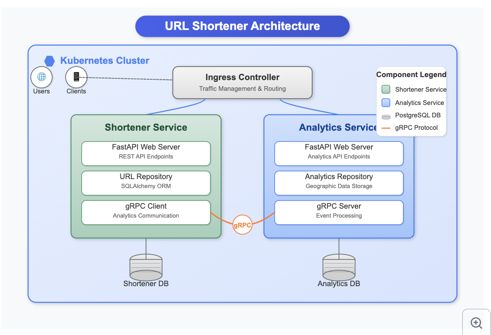

# URL Shortener with Analytics

A distributed URL shortening system with geographic analytics capabilities using microservices architecture, FastAPI, and Kubernetes deployment.

## Project Overview

This project implements a scalable URL shortening service with detailed analytics capabilities. It's built as a microservices architecture with separate shortener and analytics services communicating via gRPC. The system is containerized with Docker and designed for Kubernetes deployment.

## Architecture



### Components

- **Shortener Service**: Core service for URL shortening operations
  - Creates and manages shortened URLs
  - Redirects users to original URLs
  - Tracks click events and forwards data to Analytics Service

- **Analytics Service**: Collects and processes URL usage statistics
  - Receives click data via gRPC from Shortener Service
  - Stores geographic information (IP, city, country)
  - Provides API for querying analytics data

- **PostgreSQL Database**: Separate databases for each service
  - Shortener DB: Stores URL mappings
  - Analytics DB: Stores click events and geographic data

- **Communication**:
  - REST APIs for external clients
  - gRPC for internal service communication

## Features

- **URL Shortening**: Generate short, unique identifiers for URLs
- **Geographic Analytics**: Track visitor locations and usage patterns
- **Microservices Architecture**: Independently scalable services
- **Database Migrations**: Schema versioning with Alembic
- **Docker Containerization**: Consistent development and deployment
- **Kubernetes Deployment**: Production-ready configuration
- **Health Monitoring**: Service health and readiness checks
- **Error Handling**: Comprehensive error handling with unique tracking IDs

## Tech Stack

- **Backend**: Python 3.11 with FastAPI
- **Database**: PostgreSQL with SQLAlchemy ORM
- **Service Communication**: gRPC
- **Containerization**: Docker & Docker Compose
- **Orchestration**: Kubernetes
- **Configuration**: Environment variables & Pydantic Settings
- **Development Tools**: Black, Flake8, isort, mypy

## Getting Started

### Prerequisites

- Docker and Docker Compose
- Make (optional, for convenience commands)

### Local Development Setup

1. Clone the repository:

   ```bash
   git clone https://github.com/benidevo/url-shortener.git
   cd url-shortener
   ```

2. Create environment file:

   ```bash
   cp .env.example .env
   ```

3. Build and start services:

   ```bash
   make build
   # or without make
   docker compose -f docker-compose.yaml up --build -d
   ```

4. Create tables and run migrations:

   ```bash
   make db-init-and-migrate
   ```

5. Access services:
   - Shortener Service: <http://localhost:8000/docs>
   - Analytics Service: <http://localhost:8001/docs>

### API Usage

#### Shortener Service

- **Create shortened URL**:

  ```bash
  curl -X POST http://localhost:8000/api/v1/ \
    -H "Content-Type: application/json" \
    -d '{"url": "https://example.com/very/long/url/path"}'
  ```

- **Access shortened URL**:

  ```bash
  curl http://localhost:8000/api/v1/{short_code}
  ```

- **List all URLs**:

  ```bash
  curl http://localhost:8000/api/v1/
  ```

#### Analytics Service

- **Get analytics for URL**:

  ```bash
  curl http://localhost:8001/api/v1/{short_code}
  ```

### Development Commands

The project includes helpful Make commands:

```bash
# Start containers
make up

# Stop containers
make down

# Remove containers and volumes
make down_volumes

# Access service shells
make into_shortener
make into_analytics

# Run code formatting
make shortener-format
make analytics-format
```

## Future Enhancements

- Add comprehensive test suite
- Implement caching layer with Redis
- Add metrics and monitoring with Prometheus
- Set up CI/CD pipeline
- Implement user authentication
- Add rate limiting for API endpoints
- Enhance analytics dashboards
